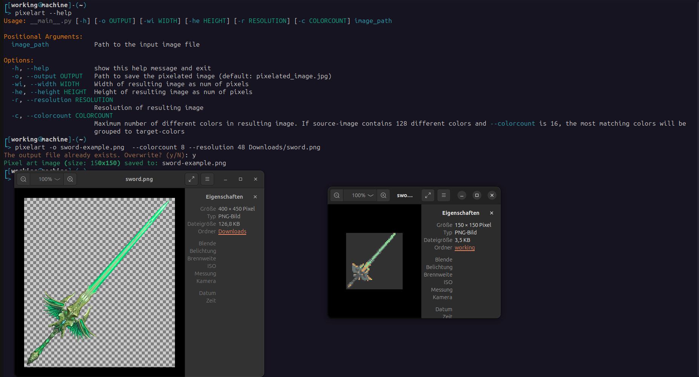

# pixelart
Simple script that converts given images into pixelart-styled images with given resolution, size and colorpalettes to create gadgets for games, animations and more!



## info
tested on linux only.

## install
```bash
poetry install .
```

If you want to run it from commandline:

1. Create bash-script & make executable
2. symlink it

```bash
sudo touch /opt/pixelart
### insert following lines into /opt/pixelart:
# #!/bin/bash
# poetry run -C ~/path/to/pixelart python3 -m pixelart.__main__ "$@"

### create symlink to bash-script 
sudo ln -s /opt/pixelart /usr/local/bin/pixelart
```

## run

If globally installed with symlink get informations via:

```bash
pixelart --help
```

Else run from project-root-dir:
```bash
poetry run pixelart --help
```
